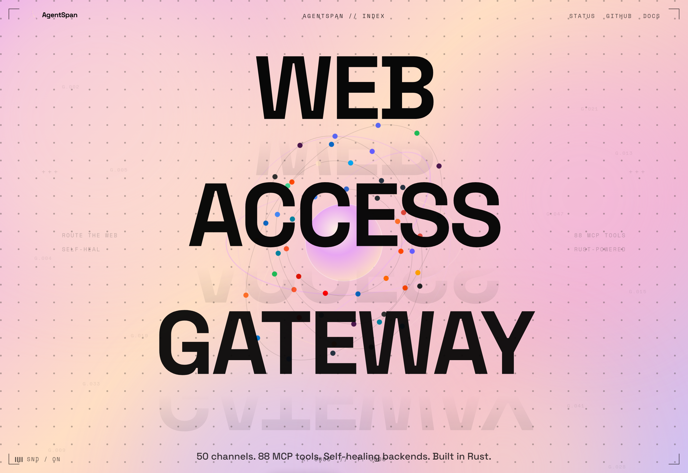
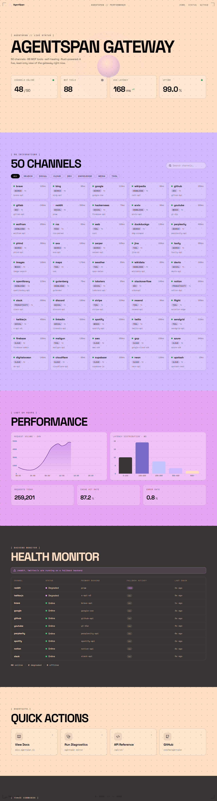
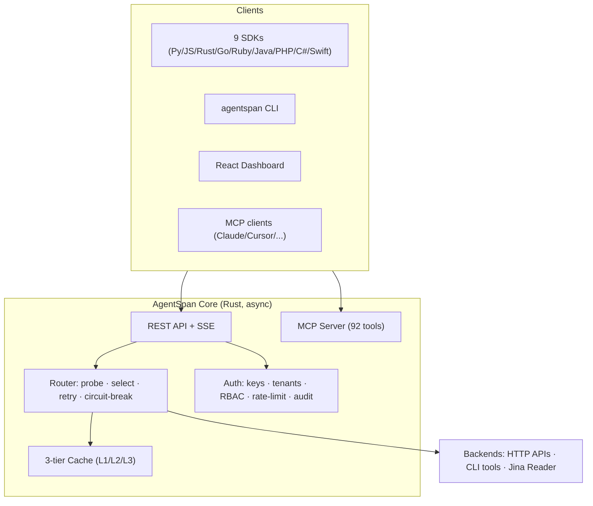

<h1 align="center">🛰️ AgentSpan</h1>

<p align="center"><strong>The Web Access Gateway for AI Agents — Multi-Platform, Multi-Tenant, Designed for Speed.</strong></p>

<p align="center">
  <a href="https://github.com/oxbshw/Agent-Span/actions/workflows/ci.yml"></a>
  
  
  
  
  
</p>

AgentSpan gives AI agents persistent, scalable, **cached** access to **52 internet
platforms** through one REST API, an SSE event stream, a native **MCP server (92
tools)**, **9 language SDKs**, a CLI, and a React dashboard — all on an async Rust core.

The channels also **heal themselves** — a background monitor auto-switches failing
backends, reinstalls broken CLI tools, and alerts on sustained outages — and the
gateway **learns from its own traffic**, suggesting cache-TTL tweaks, faster
backends, and platforms worth adding next.

> **Languages:** [English](README.md) · [中文](docs/README_zh.md) · [日本語](docs/README_ja.md) · [한국어](docs/README_ko.md)

## Why AgentSpan?

[Agent Reach](https://github.com/Panniantong/Agent-Reach) proved the "capability
layer" model (install → diagnose → route) for agent web access. AgentSpan takes that
model and turns it into a real **gateway** — it does the reading itself, behind one API.

| Capability | Agent Reach | AgentSpan |
|---|:---:|:---:|
| Architecture | Python installer (agent calls tools) | **Async Rust gateway** |
| Channels | 13 | **52** |
| Caching | ❌ | ✅ L1/L2/L3 |
| REST API | ❌ (CLI only) | ✅ + SSE + OpenAPI |
| MCP tools | 1 | **92** |
| SDKs | 0 | **9** (Py, JS/TS, Rust, Go, Ruby, Java, PHP, C#, Swift) |
| Multi-tenant / RBAC / audit | ❌ | ✅ |
| Web dashboard | ❌ | ✅ React |
| Docker | ❌ | ✅ |
| Cookie auth · transcription · installer · SKILL.md | ✅ | ✅ |

### What AgentSpan is _not_

- Not a browser-automation agent (can't click, log in, fill forms). Use
  Browser-Use or Playwright for that.
- Not a generic crawler competing with Firecrawl on arbitrary-site quality.
  AgentSpan is optimized for the 52 platforms it knows.
- Not a hosted SaaS. It's a self-hosted binary you run on your own infra.

## Website



Two surfaces, one design system — built with React 18 + TypeScript + Vite + GSAP
(ScrollTrigger) + Lenis, pure CSS (no Tailwind/Bootstrap):

- **Home** (`/`) — the marketing page; the whole scroll **is** the landing experience.
- **Status** (`/status`) — a live, read-only gateway dashboard.

### Home (`/`)

A section-based editorial / futuristic-HUD clone reverse-engineered from a
reference design and filled with real AgentSpan content:

| # | Section | What it shows |
|---|---|---|
| 0 | **Preloader** | gradient gateway orb with pulsing rings, 0→100 boot counter, terminal readouts (`<92 MCP TOOLS>`, `// 2026`) |
| 1 | **Hero** | `Web Access Gateway` display headline over a distortion-shaded coral gateway figure (its head an open ring routing a request through the sky), pink cloud-sky background, scattered coordinate tags, flank labels, `EXPLORE` / `GITHUB` pills |
| 2 | **Channels** | circular portal with the orb spinning inside + `52 CHANNELS` + 4 numbered category cards |
| 3 | **Network** | **Network grid** — all 52 channels as brand-colored silhouette avatars, each wearing the platform's real logo (or a hand-drawn glyph where no logo exists), with a live status dot + category |
| 4 | **Architecture** | pink orbital-ring diagram + the 9 Rust crates — **pinned** on scroll |
| 5 | **Features** | the 6 killer capabilities on the pink panel |
| 6 | **Showcase** | the **AGENTSPAN waveform wordmark**, stats, and the install snippet |
| 7 | **Footer** | links, MIT, version |

Signature chrome: corner-frame brackets, a live mouse-coordinate HUD, a sound
toggle, dot-grid section texture, animated chevron pill CTAs, a 1s per-section
background cross-fade, and GSAP scroll-reveal on every section.

### Status dashboard (`/status`)



A read-only at-a-glance view of the gateway, sharing the home page's chrome,
fonts, colors and animations: gateway **status header** (count-up stat cards),
a searchable/filterable **grid of all 52 channels**, **performance charts**
(request volume + latency, recharts), a **health monitor** table with fallback
status, **quick actions**, and a copy-to-clipboard **install snippet**.

**Launch:** `cd web && npm install && npm run dev` → `/` and `/status`.
(`?static` renders without the preloader/smooth-scroll, handy for screenshots.)

## Architecture



## Quick start (3 commands)

```bash
cargo run --bin agentspan -- serve            # 1. start the gateway on :8080
curl "localhost:8080/api/v1/read?url=https://example.com"   # 2. read any page
curl "localhost:8080/api/v1/channels/hackernews/search?q=rust"  # 3. search
```

Or with Docker:

```bash
docker compose up --build      # API + UI + Redis + PostgreSQL + Prometheus + Grafana
```

### Use with AI agents (Claude Code, Cursor, Windsurf)

```bash
# One command — writes the MCP config to the right file automatically:
agentspan mcp install --client claude-code    # or: cursor, windsurf, cline

# Or print the config and paste it yourself:
agentspan mcp print-config --client cursor

# See all 92 tools:
agentspan mcp tools
```

See the full guides: [Claude Code](docs/guides/use-with-claude-code.md) ·
[Cursor](docs/guides/use-with-cursor.md) ·
[Windsurf](docs/guides/use-with-windsurf.md).

### Use an SDK

```python
# Once published to PyPI:
# pip install agentspan
# Until then, install from source:
pip install -e sdk/python
from agentspan import AgentSpanClient
client = AgentSpanClient(base_url="http://localhost:8080")
print((await client.read("https://example.com")).body)
```

See [sdk/README.md](sdk/README.md) for all 9 languages and
[docs/api-reference.md](docs/api-reference.md) for the full API.

## Channels (52)

| Tier 0 (zero-config) | Tier 1 (needs key/cookie) |
|---|---|
| web, github, youtube, tiktok, rss, hackernews, v2ex, exa, wikipedia, arxiv, quora, pinterest, npm, crates, pypi, gitlab, dockerhub, wayback, maps, weather, coinbase, duckduckgo, gnews, statuspage, huggingface, devto, openlibrary, gutenberg, lobsters, wikidata | twitter, reddit, bilibili, xiaohongshu, instagram, linkedin, xueqiu, xiaoyuzhou, discord, telegram, spotify, twitch, scholar, podcasts, openai, anthropic, brave, bing, google, notion, slack, flight |

Every channel implements `read` and/or `search`, runs through a health-checked
backend router, and reduces tokens via `format_for_llm`. Run `agentspan doctor`
to see which backend is serving each channel right now.

## CLI

```
agentspan serve | doctor | watch | format | benchmark | transcribe | tunnel
         | plugin | install | uninstall | setup | config | skill | mcp | completions | update
```

Highlights: `benchmark` (cache-hit vs backend p50/p99), `tunnel` (public URL via
cloudflared), `plugin` (community channels), `transcribe` (Whisper), `format`
(per-channel token-reduction rules), `completions <shell>` (bash/zsh/fish/
powershell/elvish), and `config backup`/`config restore`.

## Observability & operations

- **`GET /metrics`** — Prometheus text exposition (request counts, errors, shed
  requests, latency, channel gauge). Public, so scrapers need no API key.
- **Request tracing** — every request/response carries an `x-trace-id` (an
  inbound `x-trace-id`/`x-request-id` is honoured); the id is attached to audit
  events for correlation.
- **Resource limits** — a 2 MiB request-body cap plus a global in-flight
  concurrency limit that sheds excess load with `503` instead of unbounded
  queueing.
- **Graceful shutdown** — `agentspan serve` drains in-flight requests on Ctrl-C
  and (on Unix) `SIGTERM`.

## Smart routing & content

- **Adaptive routing** — opt in with `BackendRouter::with_adaptive_routing()`.
  The router learns each backend's EWMA latency and success rate from live
  traffic and prefers the better performer within a health tier. Unknown
  backends stay optimistic so they still get tried.
- **Content intelligence** — fetched pages are classified (article / forum /
  code / docs) with key facts (URLs, dates, code blocks), reading stats
  (word/sentence count, reading time), and an **extractive summary** (the most
  salient sentences) pulled out and attached as metadata; `smart_truncate` trims
  on sentence boundaries, not mid-word. All dependency-free heuristics — no model
  calls.
- **Conditional revalidation** — the direct-HTTP path remembers `ETag` /
  `Last-Modified` and revalidates with `If-None-Match` / `If-Modified-Since`, so
  unchanged pages come back as a cheap `304` instead of a full re-download.
- **Federated search** — `POST /api/v1/search/federated` queries many channels
  at once, de-duplicates by URL (merging which channels found each result), and
  ranks cross-source hits first. One channel failing doesn't sink the query.
  Pass `"rerank": true` to instead order results by a dependency-free lexical
  relevance score (title-weighted TF with a phrase bonus), and `"collapse": true`
  to merge near-duplicate hits (the same story re-syndicated under different
  URLs) by title similarity.
- **Request coalescing** — `with_request_coalescing()` collapses a dogpile of
  concurrent identical reads into a single upstream fetch (single-flight), so
  five agents asking for the same URL in the same second hit upstream once.

## Agent memory

A namespaced key/value scratchpad so agents can persist small state — cursors,
seen-sets, notes — across requests without standing up their own store:

```bash
curl -X PUT localhost:8080/api/v1/memory/agent1/cursor \
  -H 'content-type: application/json' -d '{"value":{"page":3},"ttl_secs":3600}'
curl localhost:8080/api/v1/memory/agent1/cursor      # -> {"value":{"page":3},...}
curl localhost:8080/api/v1/memory/agent1             # -> {"keys":["cursor"]}
```

In-memory and process-local (survives requests, not a restart); entries take an
optional TTL and are swept lazily. `GET`/`PUT`/`DELETE` on
`/api/v1/memory/{namespace}/{key}`, `GET` on `/api/v1/memory/{namespace}`.

## AI-native content primitives

Dependency-free, deterministic building blocks in `agentspan-channels` that make
reads cheaper and more useful for agents — no model calls, no extra services:

- **Token-budget compiler** (`budget::fit_to_budget`) — "give me this page in
  ≤ 2 000 tokens." Fits any text to a hard token ceiling, degrading gracefully from
  extractive summary to boundary-aware truncation, and reports which strategy it
  used. The estimate is a safe upper bound, so the ceiling holds.
- **Content fingerprinting** (`fingerprint`) — an exact FNV-1a hash plus a 64-bit
  SimHash, so an agent can ask "did this page *meaningfully* change since I last
  read it, and by how much?" without diffing bodies. Complements ETag revalidation
  (which only says the bytes differ).
- **Structured extraction** (`extract`) — pull typed fields (title, links, dates,
  emails, prices, summary) into JSON and project just the keys you asked for, so a
  channel can answer in a fixed schema with zero LLM-extraction spend.

These ship as library primitives; REST/MCP surfacing is the next wave.

## Project structure

```
crates/         Rust workspace (core, probe, router, cache, auth, channels, mcp, api, cli)
sdk/            9 SDKs (python, js, rust, go, ruby, java, php, csharp, swift)
web/            React marketing site + admin dashboard (Vite + GSAP + Lenis)
integrations/   MCP client configs, VS Code/JetBrains/Nvim plugins, GitHub Action
plugins/        Community channel registry
docs/           API reference, guides, mdbook site, i18n
tests/          Integration + load test suites
```

See [KNOWN_ISSUES.md](KNOWN_ISSUES.md) for current rough edges and build quirks.

## Community

- [Issues](https://github.com/oxbshw/Agent-Span/issues) — bugs and feature requests
- [Discussions](https://github.com/oxbshw/Agent-Span/discussions) — questions and show & tell
- [CONTRIBUTING.md](CONTRIBUTING.md) — how to add a channel or MCP tool

## License

MIT — see [LICENSE](LICENSE).

## Security

- Binds to `127.0.0.1` by default; the Docker image sets `0.0.0.0`.
- Single-user mode (default): admin routes return `403`. Set
  `auth.require_api_key=true` to enable scoped API keys.
- API keys stored as SHA-256 hashes; `~/.agentspan/config.yaml` is `0600` and
  secrets are masked in output/logs. See [SECURITY.md](SECURITY.md).

## License

MIT — see [LICENSE](LICENSE).
